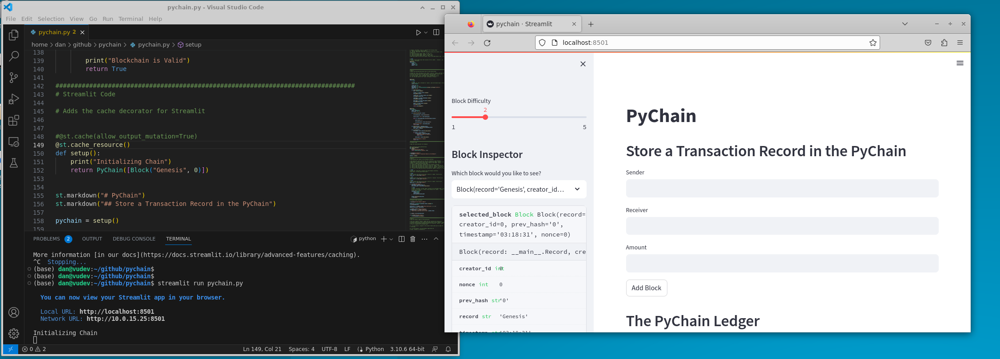
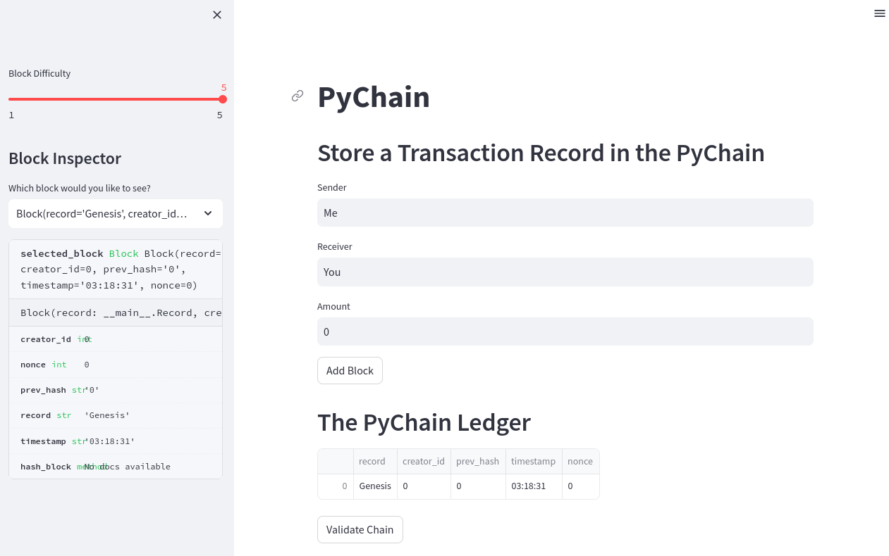
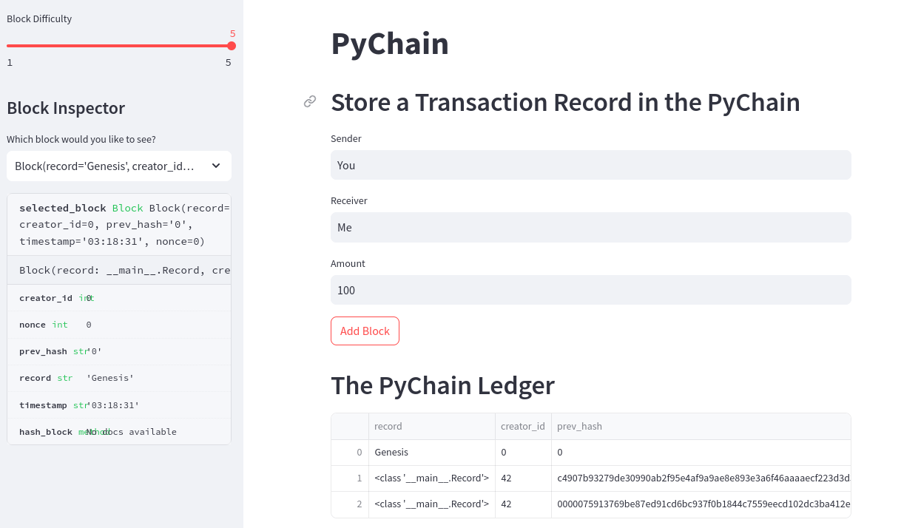
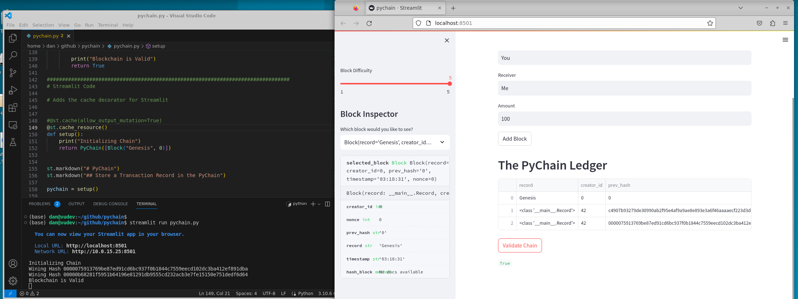

# Module 18 - PyChain Ledger

This is the page for the eighteenth module of the Fintech Bootcamp course, covering introduction to Blockchain.

This page is a continuation of my GitHub learning structure for this course.

Above you will see the *^*.ipynb file for this homework

## Streamlit Blockchain

We wrote a simple blockchain in python using streamlit, dataclass and hashlib.

This launched a browser app and enabled block creation using input fields.

I created a couple of entries and he pychain ledger stored the records created with their hash.

I then validated the chain.

## Results

* __*1 - App Launching*__
   

  

 

* __*2 - Block Creation*__
   

  

 

  

 

* __*3 - Chain Validation*__

  

 

## Back to Fintech Home

* [Fintech Bootcamp Home](https://github.com/d4np3/fintech)
